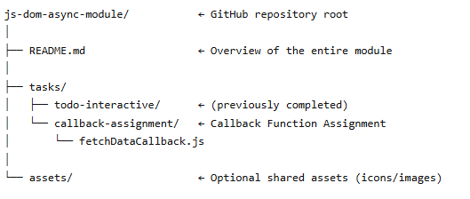

# 📝 Callback Function Assignment  

[](#)
[](#)

This project demonstrates the use of **callbacks in JavaScript** with asynchronous behavior simulated using `setTimeout`.  
It also includes **error handling** with `try/catch` to handle simulated fetch failures.  

---

## 📖 Overview  

The goal of this assignment is to practice:
- Using **callback functions** in JavaScript  
- Handling **asynchronous code** with `setTimeout`  
- Implementing **error handling** for simulated failures  
- Providing a simple, real-world-style demonstration  

---

## 🚀 Features  

✔️ Simulates an async operation with a 2-second delay  
✔️ Returns `"Data fetched"` on success  
✔️ Randomly simulates an error and logs `"Error: Fetch failed"`  
✔️ Includes an **example usage** to demonstrate functionality  

---

## 📂 Project Structure  



---

## 📄 Code Implementation  

```javascript
function fetchDataWithCallback(callback) {
  setTimeout(function() {
    try {
      // Simulate error randomly (50% chance)
      let error = Math.random() > 0.5; 

      if (error) {
        throw new Error("Fetch failed");
      }

      // On success
      callback("Data fetched");
    } catch (err) {
      console.error("Error:", err.message);
    }
  }, 2000);
}

// Example usage
fetchDataWithCallback(function(result) {
  console.log(result);
});  

```
---
## 🧪 How to Test
Clone the project and open the .js file in a browser console or Node.js environment.

Run the function:

``` javascript
fetchDataWithCallback(function(result) {
  console.log(result);
}); 

```

---
Observe behavior:

✅ Success → "Data fetched"

❌ Failure → "Error: Fetch failed"
---
##  🌍 Real-World Applications
✔️ Fetching API Data
- Handle responses from a server request and process data once it's ready.

✔️ File Operations (Node.js)
- Read or write files asynchronously, with callbacks for success/error handling.
   
✔️ User Authentication
- Validate login credentials with a database, responding differently for success vs. failure.

## 💡 Future Enhancements
✔️ 🔄 Convert implementation to Promises

✔️ 🌙 Add an Async/Await version for modern syntax

✔️ 📊 Implement a retry mechanism for failures

##  👤 Author
- Lawan Hassan Adamu
- Advance Cohort — EHA Academy

- 📧 lawanhassan.ant@gmail.com
- 🔗 https://www.linkedin.com/in/lawanadamu/
- 🔗 https://github.com/lawanhassan

💖 If you found this helpful, consider giving it a ⭐ on GitHub!