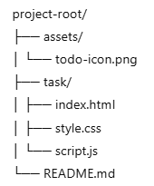
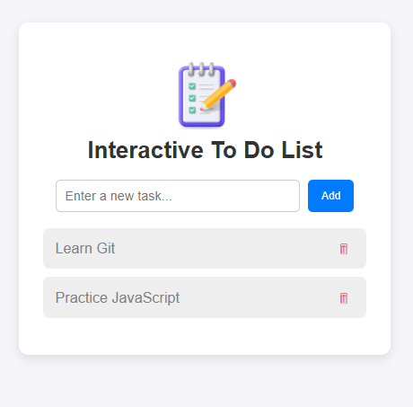

# 📝 Interactive To-Do List  
[](#)
[](#)
[](#)
[](#)

An elegant and responsive **Interactive To-Do List App** built with **HTML, CSS, and JavaScript**.  
This project was developed as part of the **Advance Cohort – EHA Academy**, demonstrating DOM manipulation, event handling, responsive design, and local storage persistence.  

🔗 **[Live Demo](http://127.0.0.1:5500/tasks/todo-interactive/index.html)**  

---

## 📚 Module Overview  

This module focused on combining **technical skills** with **soft skills** to deliver real-world projects.  
The To-Do List app was developed as a capstone exercise to demonstrate mastery of:  

- 📌 **Front-End Development** (HTML, CSS, JS)  
- 📌 **Responsive Design** for mobile and desktop  
- 📌 **DOM Manipulation** and **Event Handling**  
- 📌 **Persistent Data** storage with `localStorage`  
- 📌 **Version Control** with Git & GitHub  
- 📌 **Soft Skills**: problem-solving, clean design, documentation  

---

## 🚀 Features  

✔️ Add new tasks dynamically  
✔️ Mark tasks as **complete/incomplete** with a checkmark  
✔️ Delete tasks individually  
✔️ Save tasks with **localStorage persistence**  
✔️ Custom icon placed above the title for a professional look  
✔️ Responsive & mobile-friendly  

---

## 📂 Project Structure  
 

## 📸 Preview  

(assets/todo-screenshot.png) 

---

## 🛠️ Technologies Used  

- **HTML5**  
- **CSS3** (Flexbox & Media Queries)  
- **JavaScript (ES6)**  
- **Git & GitHub**  

---

## ⚡ Getting Started  

1. Clone this repository  
   ```bash
   git clone https://github.com/yourusername/todo-list-app.git


## 💡 Future Enhancements
✔️ 🗑 Add a Clear All button

✔️🔔 Implement task reminders with notifications

✔️🌙 Add Dark Mode

✔️📊 Support task categories (Work, Personal, Study, etc.)

## 👤 Author
- Lawan Hassan Adamu
- Advance Cohort — EHA Academy

- 📧 lawanhassan.ant@gmail.com 
- 🔗 https://www.linkedin.com/in/lawanadamu/
- 🔗 https://github.com/lawanhassan

💖 If you like this project, consider giving it a ⭐ on GitHub!

